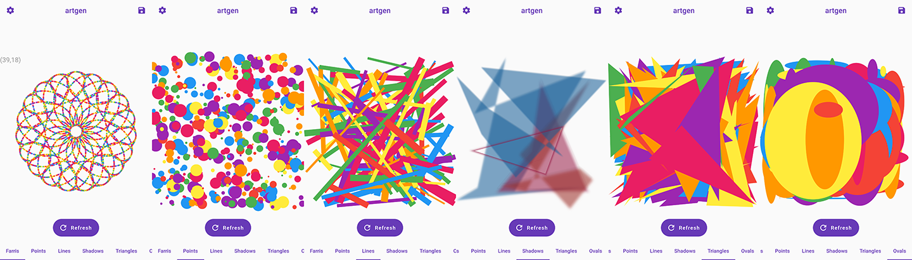

# artgen

A Flutter project that lets you randomly generate different types of art pieces and save it to your phone's gallery.
It uses MobX state management.

## Tabs

- Farris (using Frank Farris equation, [learn more here](https://www.quantamagazine.org/solution-creating-art-with-mathematics-20151030/))
- Points
- Lines
- Shadows
- Ovals
- Triangles

## Files

- main.dart : contains the widget tree
- painter.dart : containers the custom painters
- model.dart : MobX models
